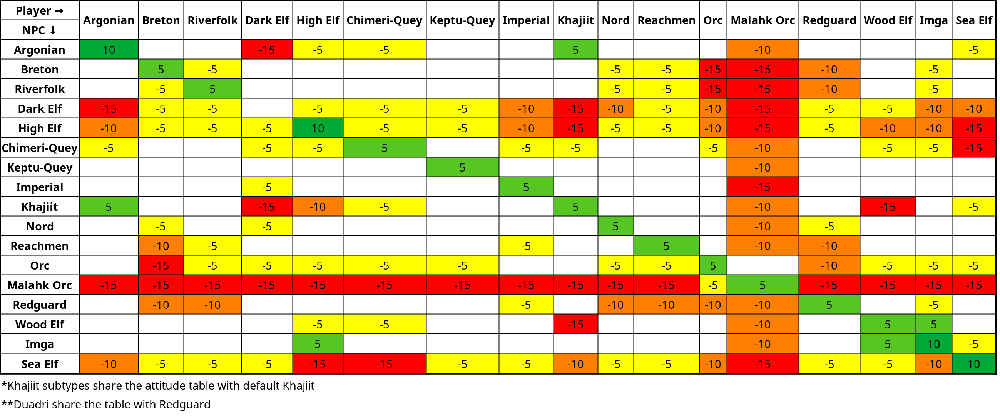

# Stranger in a Hostile Land (OpenMW)

More intricate racial attitudes to truly make you feel like an outlander.

Even though everyone and their mom knows Morrowind as the "most racist TES game" based on its presentation, the racial attitude mechanics don't live up to that reputation. In vanilla, the only race-based disposition change is +5 disposition if you're the same race as the person you're talking to. Not anymore!

Behold! The Excel spreadsheet!

These are modifiers, so they're meant to work alongside other game systems (like Personality, faction affiliation, Persuasion, etc.), not to replace them. That's why they're kept within reasonable ranges, with -15 as the maximum penalty.

Note that Player-NPC bonuses and penalties are not symmetrical. For example, a High Elf player talking to an Imga NPC results in +5 disposition, while an Imga player talking to a High Elf NPC gets -10.

Vanilla has a GMST-based bonus for same race, but this mod sets it to 0 so it doesn't get in the way.

## Reasoning

- Dunmer-Dunmer is set to 0. Outlander tax.
- On the other end of the spectrum, Argonians get an additional bonus for same race (+5), as they're heavily oppressed in Morrowind, which makes them more likely to keep to themselves and band together. Khajiit get no such bonus, as they're more varied and tend to be less organized and more individualistic.
- High Elves get +5 for High Elf-High Elf, since they don't have much of a presence in Morrowind or many other places, but keep tabs on one another. They also tend to be narcissists who love their own culture. Sea Elves also get a +5 bonus, being rarely encountered in Tamriel and mostly keeping to themselves.
- Dunmer and High Elves are quite prickly. Chimeri-Quey are like a chiller version of Altmer, also notable for their high Personality. Sea Elves are prickly like their darker- and lighter-skinned cousins, but they also really don't like the other elves, especially the Altmer.
- Dunmer and High Elves have no respect for the beastfolk at all.
- Despite having no slavery, High Elves are just as prejudiced against Khajiit as the Dunmer are. Elsweyr is much closer to Summerset than to Black Marsh or Morrowind, so High Elves are bound to have more contact with the Khajiit than the Argonians do. Khajiit are also known as thieves, like the Bosmer, and the Altmer aren't fans of the Bosmer either.
- Most of the time there are tensions between neighbors in general, but some races are chiller or more reasonably integrated.
- Orcs are often considered savages and are quite distrustful of others. However, it's no longer Daggerfall, so they're reasonably integrated into the Empire. Bretons hate them the most - too many issues, too much tension.
- Malakh Orcs are more brutal and aggressive Orcs. Nobody likes them, and they don't like the other races either. They somewhat tolerate regular Orcs, but not too closely - too soft.
- Bosmer and Khajiit tend to hate each other. Neighbors who fight all the time.
- I don't think there's enough lore and content at the moment to represent attitude differences between Khajiit subtypes, so I just use the same table for all of them.
- Imperials are pretty chill, though there's a -5 penalty for Dunmer because of all the trouble they caused and the very slow assimilation process.
- Imga are chill. They have a decent relationship with the Bosmer. However, that doesn't mean the other races - especially the non-Bosmer elves - like or accept them.

## Compatibility

Compatible with anything - be it disposition rebalances, new races or whatever.

Safe to install, update or remove mid-playthrough. Though removing it mid-playthrough won't roll back any previous changes.

Supports certain Tamriel Data races out of the box.

## Recommended Mods

- [Real Desposition](https://www.nexusmods.com/morrowind/mods/51427)
- [Better Balanced Taunt and Persuasion](https://www.nexusmods.com/morrowind/mods/58903) and/or [Gabber - Speechcraft Overhaul](https://www.nexusmods.com/morrowind/mods/58340)
- [MOAR Service Refusal](https://www.nexusmods.com/morrowind/mods/59048)
- [Same Hat](https://www.nexusmods.com/morrowind/mods/58132)

## Credits

**Cybvep** - Making the racial attitudes table  
**Sosnoviy Bor** - Scripting  
**Angelikatosh** - Initial idea ([video](https://youtu.be/pRszIgpbQwE))  
**TES IV: Oblivion** - Inspiration
